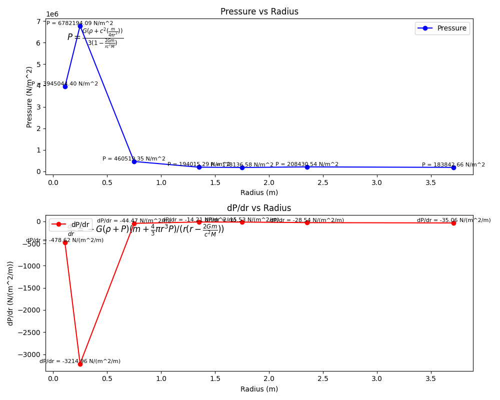
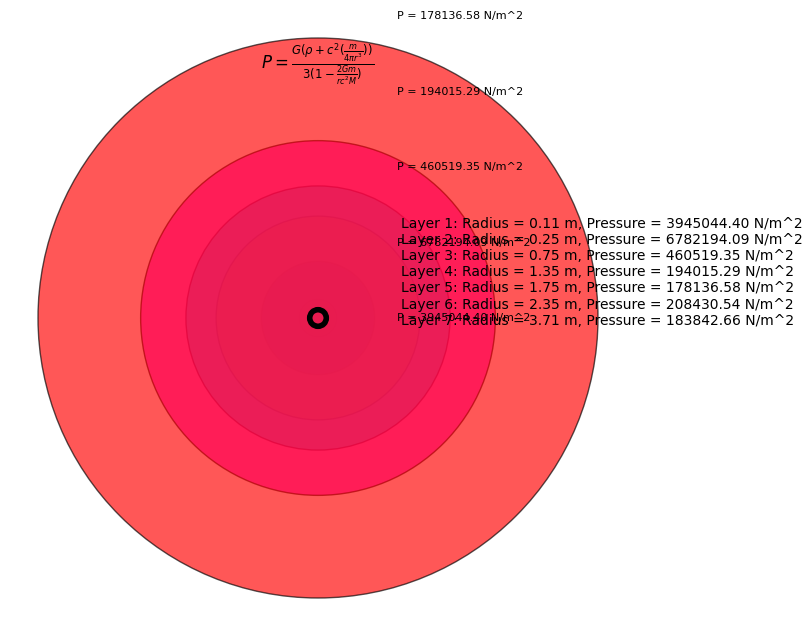

[HOME](/README.md)  / 

- Script Equations:   
                   - [Tolman Oppenheimer Volkoff](/assets/docs/earth/sci-fi/sci-fi-StarFormation/python/equations/tov.py)     

----------------------

# Results of research   

----------------

Enter the number of layers in the cluster: 7  

Layer 1:    
Choose the unit of measurement for the radius (1 for m, 2 for cm, 3 for mm): 2   
Enter the radius: 11   
Choose the mass unit (1 for t, 2 for kg, 3 for g, 4 for mg): 3   
Enter the mass: 33    
Choose the element (plutonium, uranium, curium): rutherfordium    
   
Layer 2:   
Choose the unit of measurement for the radius (1 for m, 2 for cm, 3 for mm): 2    
Enter the radius: 25   
Choose the mass unit (1 for t, 2 for kg, 3 for g, 4 for mg): 3   
Enter the mass: 666   
Choose the element (plutonium, uranium, curium): einsteinium    
   
Layer 3:   
Choose the unit of measurement for the radius (1 for m, 2 for cm, 3 for mm): 2    
Enter the radius: 75   
Choose the mass unit (1 for t, 2 for kg, 3 for g, 4 for mg): 3    
Enter the mass: 1221   
Choose the element (plutonium, uranium, curium): ytterbium  
   
Layer 4:    
Choose the unit of measurement for the radius (1 for m, 2 for cm, 3 for mm): 1    
Enter the radius: 1.35   
Choose the mass unit (1 for t, 2 for kg, 3 for g, 4 for mg): 2    
Enter the mass: 3   
Choose the element (plutonium, uranium, curium): plutonium   
    
Layer 5:     
Choose the unit of measurement for the radius (1 for m, 2 for cm, 3 for mm): 1   
Enter the radius: 1.75   
Choose the mass unit (1 for t, 2 for kg, 3 for g, 4 for mg): 2    
Enter the mass: 6   
Choose the element (plutonium, uranium, curium): uranium     
   
Layer 6:      
Choose the unit of measurement for the radius (1 for m, 2 for cm, 3 for mm): 1       
Enter the radius: 2.35      
Choose the mass unit (1 for t, 2 for kg, 3 for g, 4 for mg): 2     
Enter the mass: 17      
Choose the element (plutonium, uranium, curium): uranium     
     
Layer 7:     
Choose the unit of measurement for the radius (1 for m, 2 for cm, 3 for mm): 1      
Enter the radius: 3.71     
Choose the mass unit (1 for t, 2 for kg, 3 for g, 4 for mg): 2      
Enter the mass: 59      
Choose the element (plutonium, uranium, curium): uranium     
        
Cluster Properties:       
         
Layer 1:               
Radius: 0.11 meters    
Mass: 0.03 kilograms    
Density: 5.92 kg/m^3    
Pressure: 3945044.40 N/m^2    
dP/dr: -478.62 N/(m^2/m)    
    
Layer 2:    
Radius: 0.25 meters    
Mass: 0.67 kilograms    
Density: 10.18 kg/m^3    
Pressure: 6782194.09 N/m^2    
dP/dr: -3214.96 N/(m^2/m)    
     
Layer 3:    
Radius: 0.75 meters    
Mass: 1.22 kilograms    
Density: 0.69 kg/m^3    
Pressure: 460519.35 N/m^2    
dP/dr: -44.47 N/(m^2/m)    
    
Layer 4:    
Radius: 1.35 meters    
Mass: 3.00 kilograms   
Density: 0.29 kg/m^3    
Pressure: 194015.29 N/m^2     
dP/dr: -14.21 N/(m^2/m)    
    
Layer 5:     
Radius: 1.75 meters      
Mass: 6.00 kilograms     
Density: 0.27 kg/m^3    
Pressure: 178136.58 N/m^2     
dP/dr: -15.53 N/(m^2/m)     
      
Layer 6:    
Radius: 2.35 meters      
Mass: 17.00 kilograms      
Density: 0.31 kg/m^3      
Pressure: 208430.54 N/m^2        
dP/dr: -28.54 N/(m^2/m)     
      
Layer 7:    
Radius: 3.71 meters    
Mass: 59.00 kilograms    
Density: 0.28 kg/m^3    
Pressure: 183842.66 N/m^2     
dP/dr: -35.06 N/(m^2/m)    
     
   
   
