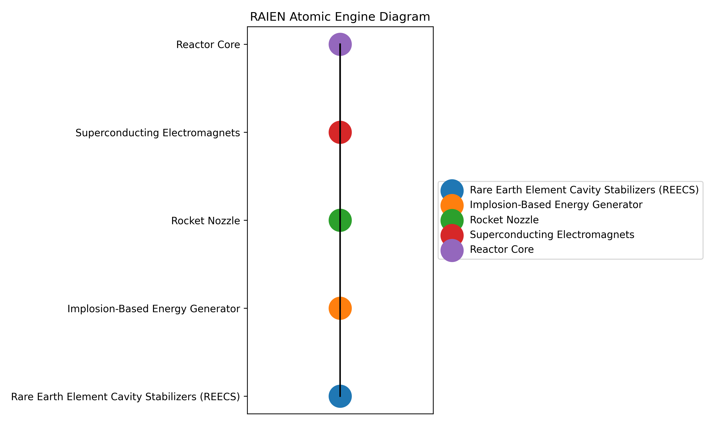

[HOME](/README.md) / [Nuclear Rockets](/assets/docs/nuclear/knowledges/nuclear-rockets/readme.md) / [Atomic Engine](/assets/docs/nuclear/knowledges/nuclear-rockets/atomic-engine/readme.md) / [Nuclear Engine](/assets/docs/nuclear/knowledges/nuclear-rockets/nuclear-engine/readme.md)  

--------------------    
    
 Codename: RAIEN   
 Project Launched: 22/07/2023   
 Actually phase: Research   
     
--------------------    

textual description of the various components of the RAIEN engine:

**1. Reactor Core:**
The heart of the RAIEN engine is its reactor core, a cylindrical structure with a length of 5 units and a radius of 1 unit. The reactor core houses the controlled nuclear fusion process that provides the energy required for the engine's operation. It is lined with Rare Earth Element Cavity Stabilizers (REECS), which ensure the safe and stable containment of nuclear reactions.

**2. Rare Earth Element Cavity Stabilizers (REECS):**
REECS are special components made of engineered rare earth elements with unique properties. They play a critical role in stabilizing the nuclear reactions within the reactor core. The REECS act as resonators, precisely controlling the nuclear processes and preventing any runaway chain reactions. Their self-regulating capabilities allow for automatic adjustment of the nuclear reaction rate based on temperature and pressure changes.

[**3. Implosion System:**](/assets/docs/nuclear/knowledges/nuclear-rockets/atomic-engine/RAIEN/Implosion-based-energy-generator.md)  
The RAIEN engine features an innovative implosion-based energy generation system. This system induces controlled nuclear implosions within the reactor core. The implosion compresses the fuel, leading to increased energy density and enhanced efficiency of the nuclear reaction. Superconducting electromagnets surrounding the reactor core generate powerful magnetic fields, enabling the implosion process.

**4. Magnetic Field Generators:**
The magnetic field generators are essential components that produce the intense magnetic fields required for the implosion process. These generators utilize superconducting materials to achieve high magnetic field strengths while minimizing energy losses. The precise control of the magnetic fields ensures the stability and safety of the implosion-based energy generation system.

**5. Fuel Rods:**
The reactor core contains specialized fuel rods that hold the nuclear fuel. These rods are designed to withstand extreme conditions, ensuring the safe containment of nuclear materials during the implosion process. The fuel rods are strategically positioned to maximize the efficiency of the nuclear reactions.

**6. Coolant System:**
To manage the intense heat generated during nuclear reactions, the RAIEN engine incorporates an advanced coolant system. This system circulates a high-performance coolant fluid throughout the reactor core and adjacent components, effectively dissipating excess heat and maintaining optimal operating temperatures.

**7. Thrust Vectoring Nozzles:**
At the aft end of the RAIEN engine, there are thrust vectoring nozzles responsible for directing the hot exhaust gases produced by the nuclear reactions. These nozzles can adjust their orientation to control the direction of thrust, providing precise maneuvering capabilities for the spacecraft.

**8. Containment Shielding:**
Safety is of paramount importance in the RAIEN engine design. The entire core is surrounded by advanced containment shielding made of specialized materials. This shielding serves as a multi-layered protective barrier, minimizing radiation leakage and protecting the spacecraft and its crew from potential hazards.

**9. Control and Monitoring System:**
To ensure the smooth operation of the RAIEN engine, a sophisticated control and monitoring system is implemented. This system continuously analyzes data from various sensors to regulate the nuclear reactions, monitor the implosion process, and maintain optimal performance and safety parameters.

**10. Power Generation and Distribution:**
The RAIEN engine's implosion-based energy generation system also produces electricity that can be used to power various onboard systems and instrumentation within the spacecraft. A robust power distribution network ensures efficient utilization of the generated electrical energy.

--------------------
    
Diagram of System, Step 1:   
   
    
--------------------     
   
  
--------------------   
